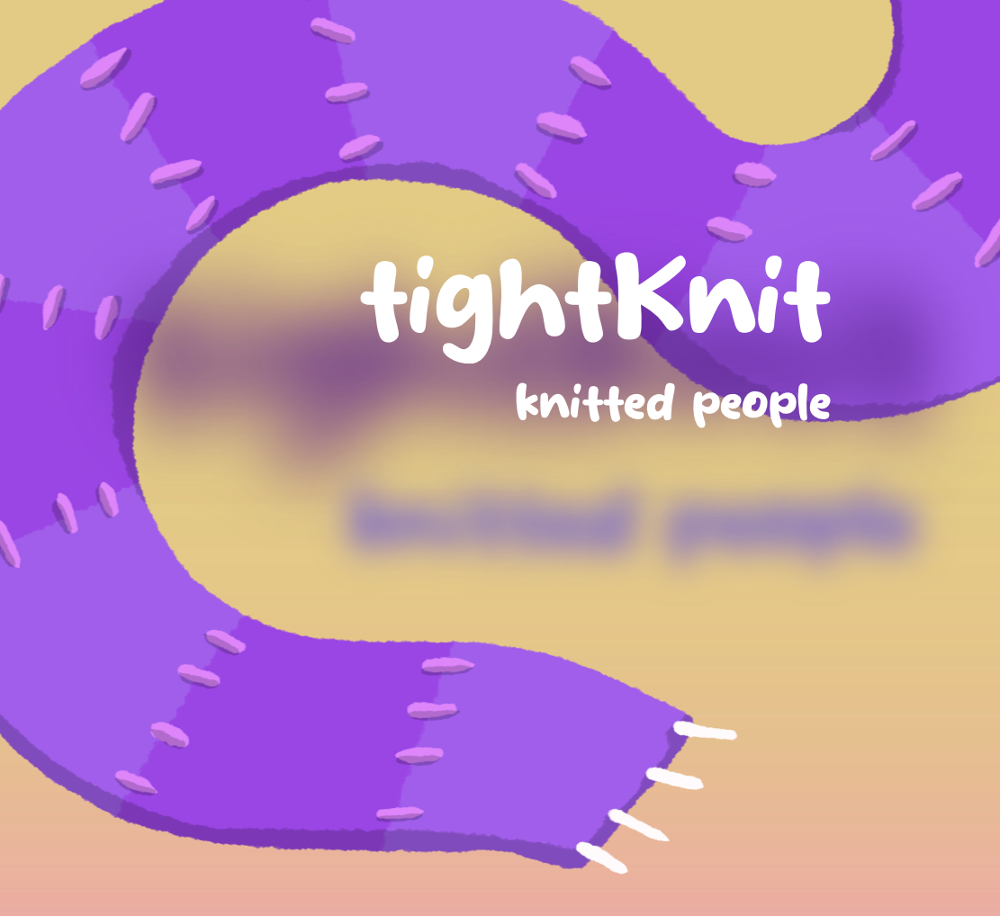
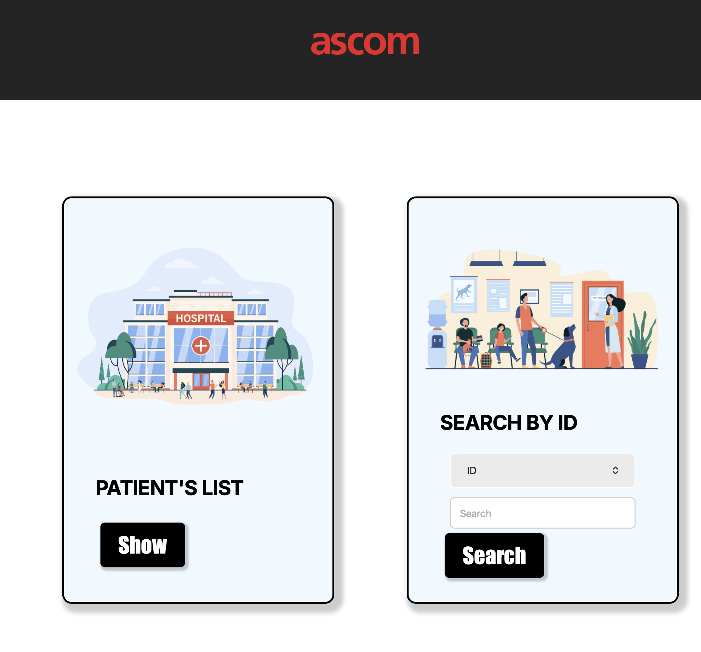
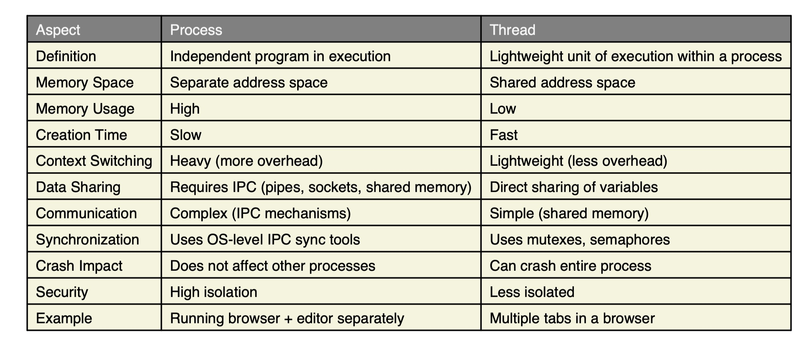

<!-- THUMBNAIL / HEADER -->

  

 

<!-- TWO COLUMNS -->
<table>
  <tr>
    <!-- LEFT BOX: BIO -->
    <td width="50%" valign="top">

### 👋 BIO

Full-Stack Developer and System Administrator with a multidisciplinary background in architecture, marketing, and visual production. I combine solid technical expertise with a user-centered and problem-solving mindset, shaped through creative and entrepreneurial experiences.
Experienced in designing scalable architectures, managing IT infrastructure, and developing web and mobile applications, with a strong interest in emerging technologies such as AI and blockchain.

- 💻 42 Firenze Alumni
- 🚀 Full-Stack Web Developer
- 🎯 Multi-disciplinary Artist Bridging Code & Creativity

    </td>

    <!-- RIGHT BOX: LINKS -->
    <td width="50%" valign="top">

  <h3 style="margin:0 0 20px 0; color:#B8860B;">🔗 Connect & Resume</h3>

  
📄 <a href="https://drive.google.com/file/d/1uA1PEWpahvtnYIDWfz6RskLVuzapOnb8/view?usp=sharing" style="color:#B8860B; text-decoration:none;">Resume (English)</a>

  
📄 <a href="https://drive.google.com/file/d/1QDocaVLdBoDPp8KkxgQfFW-ZNBu8f7Cq/view?usp=sharing" style="color:#B8860B; text-decoration:none;">Resume (Italian)</a>

  
🌐 <a href="https://amireid.github.io/CV/" style="color:#B8860B; text-decoration:none;">Portfolio Website</a>

  
📸 <a href="https://www.instagram.com/amir.m.eid/" style="color:#B8860B; text-decoration:none;">Instagram</a>

  
💼 <a href="https://www.linkedin.com/in/amireid/" style="color:#B8860B; text-decoration:none;">LinkedIn</a>

  
📝 <a href="https://drive.google.com/file/d/1cOnLMEjrDpRBsGwpukbeJpCOrrHCenQ3/view?usp=sharing" style="color:#B8860B; text-decoration:none;">Recommendation Letter</a>

  
🎓 <a href="https://your-42-transcript-link.com" style="color:#B8860B; text-decoration:none;">42 Transcript</a>

    </td>
  </tr>
</table>

 

<!-- TECH STACK BOX -->
<h1 align="center">🛠️ Tech Stack</h1>

  

 

<!-- PROJECTS SECTION -->
<h2 align="center">🚀 Projects</h2>

| weavETH (Mobile App)                                                                                              | ASCOM (Frontend Client)                                                                        |
| ----------------------------------------------------------------------------------------------------------------- | -------------------------------------------------------------------------------------- |
|                                 |  |
| **Tech:** React Native (expo), Solidity (HardHat),   AI Module integration (Photo modification), WalletConnect | **Tech:** React, Vite, Axios, JavaScript, CSS Modules                                  |

<table align="center">
  <tr>
    <td align="center">
      <strong>Processes VS Threads (Philosophers)</strong>  
        
      <strong>Tech:</strong> C, POSIX Threads, Mutexes, Time management, 
      Synchronization primitives, Semaphores, Signals, POSIX IPC
    </td>
  </tr>
</table>

